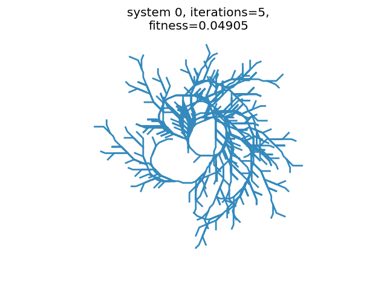

# Natural Computing: Final project

## Applying EA to L-Systems

### Setup

To run the project you need python3 and make sure to have the packages listed in `requirements.txt` installed. 
If they are not installed yet, do so using pip or conda.
 
### Running a simulation

To run a simulation run the `src/main.py` file. From our tests, this does not work from the command line. We recommend 
using an IDE like PyCharm to run this project.  

#### Changing settings

To run a different experiment using different settings you can change in main.py:

##### 1. the values of the `parameters` dictionary.
The default is:
```python
parameters = {"angle": 22.5,
              "pop_size": 30,
              "iterations": 5,
              "nr_gens": 500,
              "tournament_size": 5,
              "p_mutation": 0.75,
              "fitness_func": 'convex'
}
```

   - possible value for `fitness_func` are: `convex` and `hu`. By default `convex` uses the Hu moments metric in a 
   alternating fashion.

##### 2. change the setting of the `goal` LSystem object.
The default is:
```python
goal = LSystem(axiom='A',
               rules={'B': 'BB', 'A': 'B[+AB-[A]--A][---A]'},
               angle=parameters["angle"],
               iterations=parameters["iterations"])
```

### Sample run

1. Run `src/main.py` with desired settings

2. Obtain results. Results are not save automatically but must be manually saved when shown at the end of the simulation.

Outputs are plots for the systems with the best fitness of the last generation and textual output of describing the systems 

Consol output of an example system:
```
turtle 0:
	- axiom:    D
	- t.-rules: {'D': 'D[BD--DA]', 'A': 'B-+DAD+B-', 'C': 'BADD', 'B': 'DB+B'}
	- fitness:  0.04905
```

Plot of the above example system 0:


